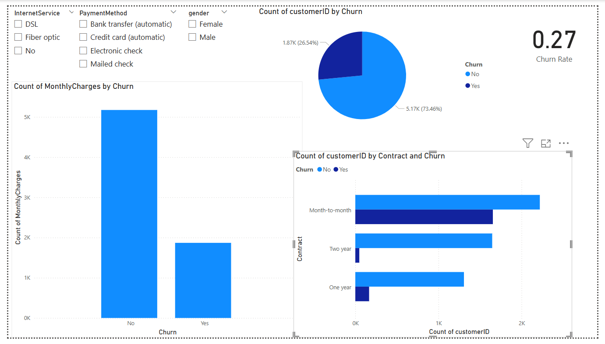

# 🧠 Customer Churn Prediction

A complete end-to-end machine learning project to predict customer churn for a subscription-based telecom company using:
- Python & Scikit-learn
- Streamlit App Deployment
- SQL for backend analytics
- Power BI for Business Dashboards
---
## ✅ Results Summary

- Final model: Random Forest
- Accuracy: 77.3%
- ROC AUC: 0.71
- Churn rate: ~26%
- Most important feature: Contract type
---

## 📁 Project Structure
- app/ → Streamlit app
- data/ → Raw CSV and SQLite DB
- images/ → Dashboard & EDA screenshots
- EDA, ML modeling, SQL analysis notebooks
- powerbi/ → .pbix dashboard file
- sql/ → Raw SQL queries
- requirements.txt → Python dependencies
- README.md → You're here!

---

## 📊 Power BI Dashboard

The dashboard highlights:
- Churn rate by contract type
- Monthly charges and tenure effects
- Payment method trends

🖼️ Preview:



📁 File: [`churn_dashboard.pbix`](churn_dashboard.pbix)

---

## 🔎 SQL Analysis

Used raw SQL to query key churn metrics via SQLite:

- Total churned customers
- Churn rate by contract
- Avg monthly charges (churned vs retained)

🗃️ [`sql_analysis.ipynb`](sql_analysis.ipynb)  
📄 [`queries.sql`](./sql/queries.sql)

---

## 🔬 Machine Learning

Built multiple models:
- Logistic Regression
- Random Forest
- XGBoost (best performer)

Includes SMOTE balancing, metrics comparison, feature importance.

📓 [`EDA.ipynb`](EDA.ipynb)
---

## 🌐 Streamlit Web App

🚀 Live App: [Click here to try the Churn Predictor](https://rqksaqtxnqpiqt9nh5nmpw.streamlit.app/)

Deployed app for churn prediction using trained model.

```bash
streamlit run app/app.py
